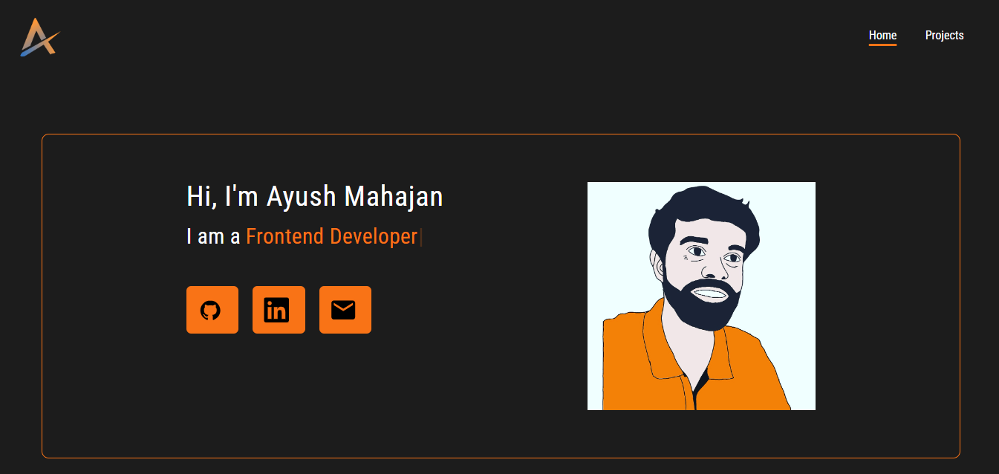

# Portfolio-React
 
## Table of Content

 * [Overview of the Project](#overview-of-the-project)
      * [Screenshot](#screenshot)
 * [Technologies I Used](#technologies-i-used)

# Overview of the Project
This is the updated version of my portfolio made with React using Tailwind CSS for styling.

## Screenshot

## Technologies I Used
* React.
* Tailwind CSS.
